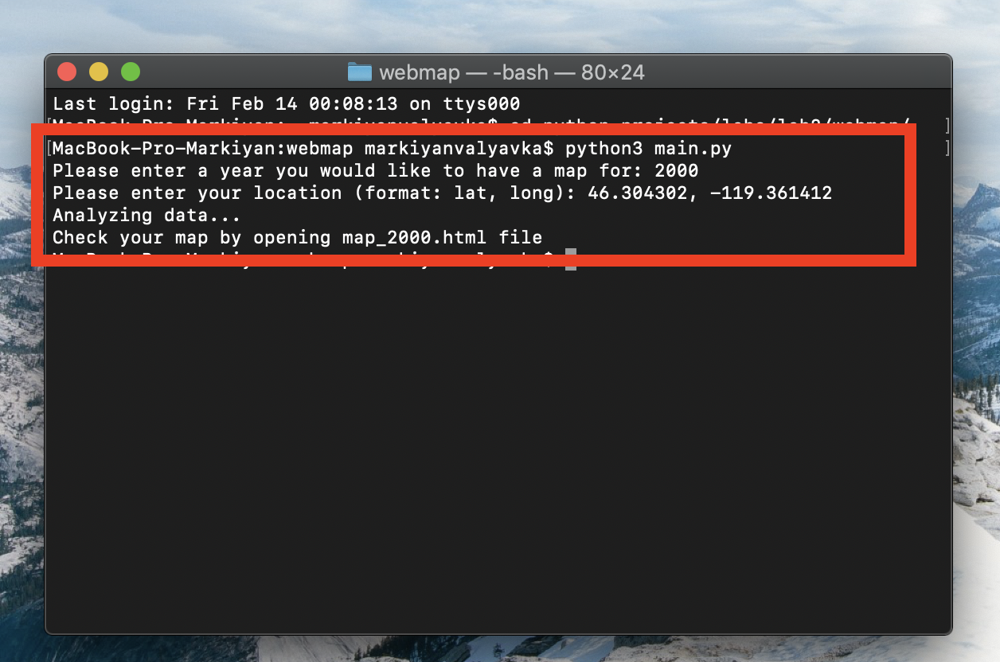
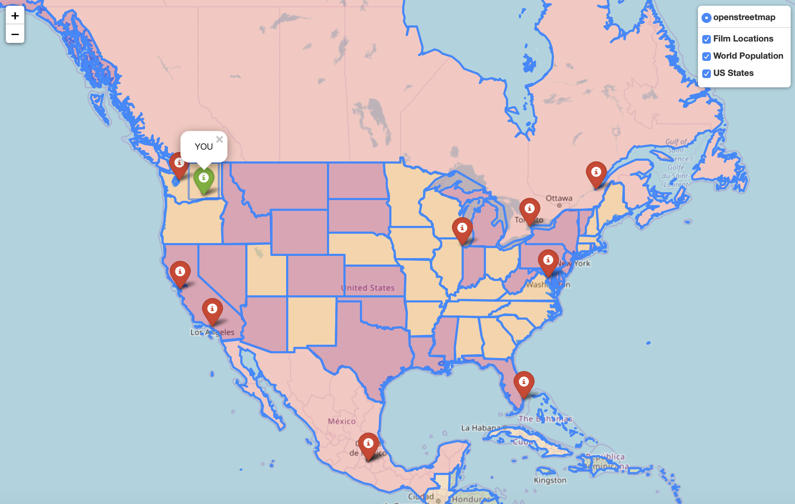

# film_locations_map

A map that shows 10 closest film shooting spots around your location.

The overall film pool is ~250,000 films and locations.
This data is first filtered by year input, and then by distance to input location. (10 closest are taken)
The real location in coordinated is calculate only for 50 films, for speed purposes.
Nevertheless, the locations are pretty accurate, although different each time.

/* map_{year}.html file structure */
 
HTML file is generated by folium library, which is a main < div > container in the file. 
There are two additional maps (layers) that can be turned on/off, which are generated from .json files

/* Summary */

The map gives us information about film that were shot around any location and in any year.
It is easy to see popular shooting place in the world by looking on the map. 
For example, most of the films are usually shot in Europe and the US. If we put Los Angeles as our current location, closest films would most certainly be in the city. Thus, we assume that LA must be a popular shooting spot (Of course, because Hollywood is there)

/* Example Run */

Assume our location is West Richmond, US

